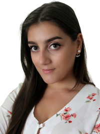

# Curriculum Vitae

### **Cátia Moura**

  

## RESUME
- Speech and Language Therapist seeking for an opportunity on her other passion: the Information Tecnologies.
- Expert on communication, proactive and with a strong will to learn and to teamwork.
- Experience in team and project management. 

**Languages**
- Portuguese: Native
- English: C1

**Highlighted Skills**
- Computer Skills
- Fluent in English
- Organization
- Communication
- Easy Learner
- Proactive
- Motivated
- Autonomous
- Methodic
- Great Time Management
- Service-Focused
- Excellent at Teamwork
- Strong Sense of Responsability

## EDUCATION

**Certification in Data Analysis - Power BI (currently), EISNT Tecnology**
- Databases needs
- Systems analysis
- Entity-Relationship Model and relational databases
- Data integrity and consistency
- Database management systems
- Database query language
- Creation, modification and deletion of entities
- Inserting, changing, searching and deleting data
- Transactions, privileges and access control

**Degree on Speech and Language Therapy, 2015-2019, ESSLEI COLLEGE**
- Communication
- Vocal Technique
- Orofacial Motricity
- Language
- Speech
- Fluency
- Basic Life Support

**Post-Graduation on Communication, Language and Speech Disorders, 2021-2022, CRIAP INSTITUTE**
- Neuropsychology
- Voice Disorders
- Fluency Disorders
- Anxiety 
- Deafness
- Development Disorders
- Multi-Disability

## PROFESSIONAL EXPERIENCE

**PICIE Team, Leiria (May '21 - currently)**
- Speech and Language Therapist (Prevention, Evaluation, Intervention and Maintenance on School Context, with children from 4y to 12y).
- Project Manager
- Team Manager
- Content Creator and Social Media Manager

**Ser+ Clínic, Amarante (Sep. '20 - Jul. '21)**
- Speech and Language Therapist (Prevention, Evaluation, Intervention and Maintenance on Clinic Context, with people from 1y to 18y).

**Hospital Agostinho Ribeiro, Felgueiras (Sep. '19 - Sep. '21)**
- Speech and Language Therapist (Prevention, Evaluation, Intervention and Maintenance on Hospital Context, with people from all ages).

## CERTIFICATIONS
- Sales and Coaching Technique, FollowPharma (2020)
- Brain Aging Certification, FollowPharma (2020)
- Adult Oropharyngeal Dysphagia Certification Carolina Branco e Susana Portinha (2019)
- Method Fonomimic Webinar – The Reading Magic, Paula Teles (2020)
- III IPA Journey (2019)
- 1ª Knowledge Sharing - Provided Caring on Dementia, Fundação José Relvas (2019)
- 10º Neurodevelopment Journey - Behaviour and Learning; Learn to behave, CHMT (2019)
- Workshop Linguistics, Language Development and Impairment VIII, Universidade de Lisboa (2018)

  
